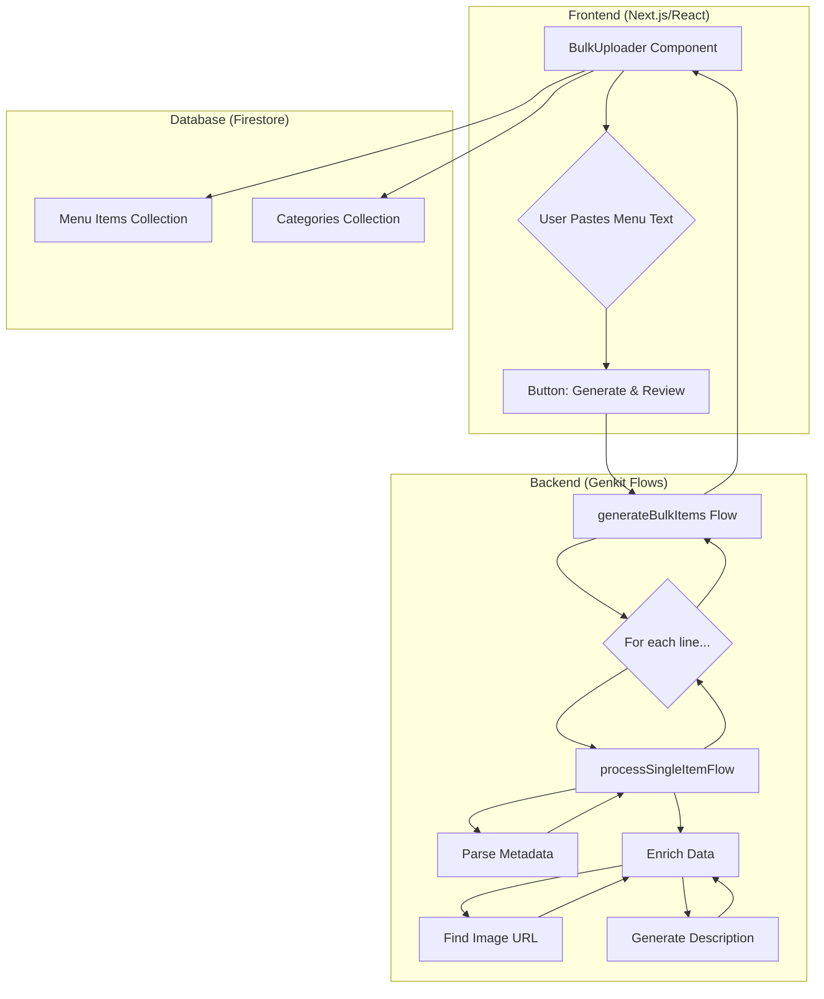
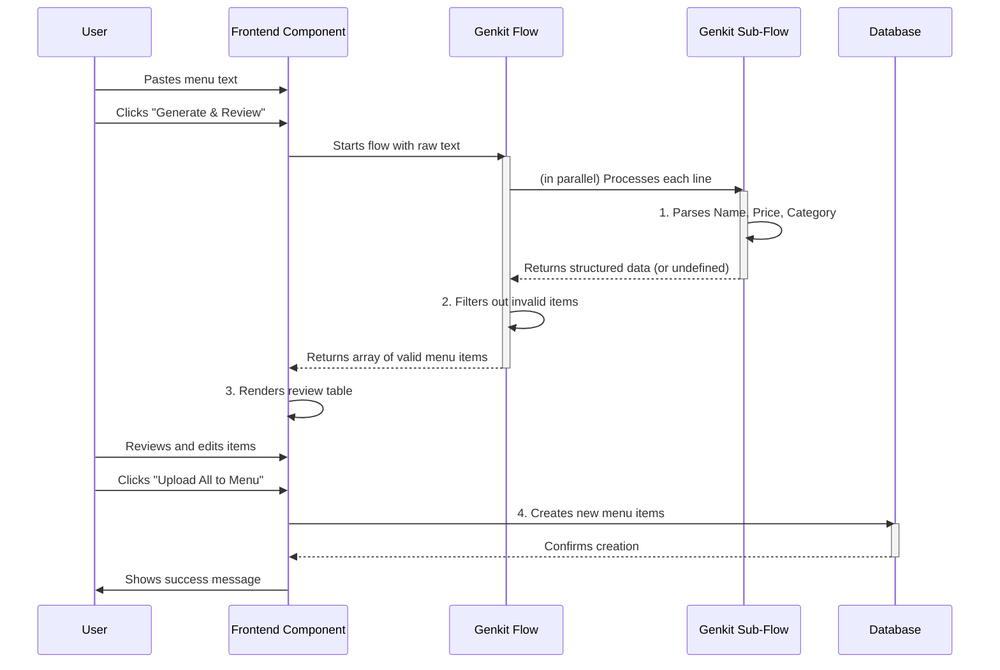

# AI Genesis Uploader: Technical Workflow & Architectural Overview

This document provides a comprehensive overview of the AI Genesis Uploader, a feature designed to rapidly parse, enrich, and upload menu items from raw text into the application's database.

## 1. High-Level Architecture Diagram

This diagram illustrates the main components of the application and their interactions.

## 2. Sequence Diagram: AI Genesis Workflow

This diagram details the step-by-step process of the "AI Genesis Uploader" workflow.

## 3. Detailed Workflow Description

The workflow is divided into three main stages: Frontend Interaction, Backend Processing, and Database Finalization.

### Stage 1: Frontend Interaction (`BulkUploader.tsx`)

1.  **Input:** The user pastes a raw text menu into a `<Textarea>` element in the `BulkUploader` component.
2.  **Initiation:** The user clicks the "Generate & Review" button. This triggers the `handleGenerate` function.
3.  **Preprocessing:** The raw text is split into lines. A `lastSeenCategory` variable is used to associate items with the last mentioned category heading.
4.  **Backend Call:** The pre-processed lines are sent to the `generateBulkItems` Genkit flow.

### Stage 2: Backend Processing (`generateBulkItems.ts`)

1.  **Orchestration:** The `generateBulkItems` flow receives the array of item lines and orchestrates the entire process.
2.  **Parallel Processing:** It uses `Promise.all` to call the `processSingleItemFlow` for each line concurrently, maximizing efficiency.
3.  **Single Item Processing (`processSingleItemFlow`):**
    *   **Parsing:** The `parseCoreMetadataPrompt` (an AI prompt) is used to extract the `name`, `price`, `category`, and other flags from the raw text line. **Crucially, if a clear, single price is not found, the item is skipped.**
    *   **Enrichment:** Two other flows are called in parallel:
        *   `generateDescription`: Generates a descriptive text for the item.
        *   `findImageUrl`: Searches for a relevant image URL.
    *   **Validation:** The assembled item object is validated against the `GeneratedItemSchema` using `zod.parse()`. This ensures data integrity and applies default values (like `isAvailable: true`).
4.  **Filtering:** Back in the main `generateBulkItems` flow, the results from the parallel processing are filtered to remove any `undefined` or `null` values (i.e., items that were skipped).
5.  **Response:** The clean, validated array of generated menu items is returned to the frontend.

### Stage 3: Database Finalization (`BulkUploader.tsx`)

1.  **Review & Edit:** The `BulkUploader` component receives the array of generated items and displays them in a review table. The user can edit any of the AI-generated fields.
2.  **Category Creation:** If the AI identifies a new category, the frontend automatically creates it in the Firestore `categories` collection.
3.  **Upload:** The user clicks "Upload All to Menu." The `onSubmit` function is called.
4.  **Database Write:** The component iterates through the final, reviewed items and creates new documents in the Firestore `menuItems` collection.

## 4. Pros and Cons

### Pros

*   **Speed:** The parallel processing architecture allows for very fast generation of menu items, even from large inputs.
*   **Resilience:** The use of Zod schemas and validation at multiple stages ensures that only clean, valid data enters the database.
*   **Automation:** The automatic category creation and AI-powered data enrichment significantly reduce manual data entry.
*   **Modularity:** The separation of concerns into distinct flows (`generateDescription`, `findImageUrl`) makes the system easy to maintain and extend.

### Cons

*   **Strict Price Parsing:** The current system's inability to handle complex price formats (e.g., "Single/Full") is a major limitation, causing many items to be skipped.
*   **AI "Black Box":** The reliance on AI for parsing can sometimes lead to unpredictable results, as the AI might be overly cautious and skip items that seem clear to a human.
*   **Noisy Server Logs:** The current logging for skipped items can be verbose, making it harder to debug other issues.

## 5. Do's and Don'ts

### Do

*   **Extend the Schemas:** When adding new fields, always start by updating the Zod schemas (`CoreMetadataSchema`, `GeneratedItemSchema`).
*   **Create Modular Flows:** For new AI-powered features, create new, single-purpose Genkit flows and integrate them into the main orchestrator.
*   **Handle Errors Gracefully:** When calling flows, always wrap them in `try...catch` blocks to handle potential failures without crashing the application.
*   **Validate on the Server:** Always validate data returned from AI prompts on the server before sending it to the client.

### Don't

*   **Trust Client-Side Validation Alone:** Never assume that data coming from the client is valid. Always re-validate on the server before writing to the database.
*   **Write Monolithic Flows:** Avoid adding too much logic into a single Genkit flow. Keep them small and focused.
*   **Bypass Zod Parsing:** Do not manually assemble objects that are defined by a Zod schema. Always use `.parse()` to ensure defaults and transformations are applied.

## 6. Capabilities and Future Enhancements

### Current Capabilities

*   Bulk parsing of menu items from raw text.
*   Automatic generation of item descriptions.
*   Automatic discovery of item image URLs.
*   Automatic creation of new menu categories.
*   A user-friendly review and editing interface before final upload.

### Potential Future Enhancements

*   **Advanced Price Parsing:** Enhance the `parseCoreMetadataPrompt` to understand and extract multiple prices (e.g., "Single," "Full," "Family Pack").
*   **Item Variants:** Implement a system for creating item variants (e.g., different sizes or spice levels) from a single line of input.
*   **Image Generation:** Instead of just finding images, integrate an image generation model to create unique images for each menu item based on the `imageHint`.
*   **Real-time Validation:** Provide real-time feedback to the user as they type in the text area, indicating which lines are being successfully parsed.
